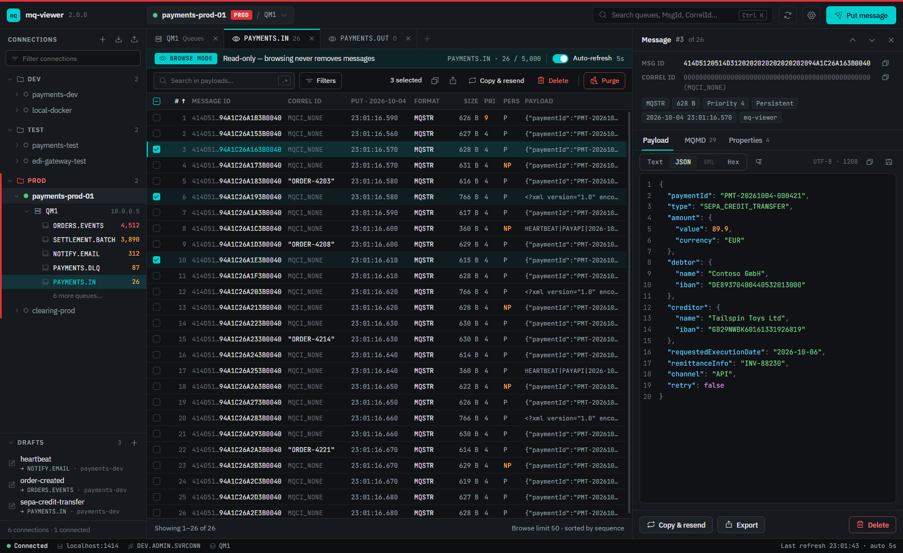
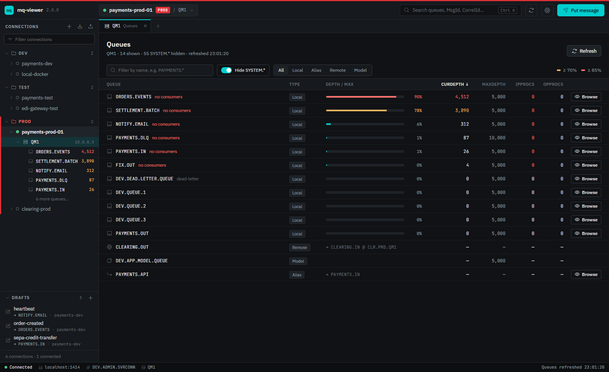
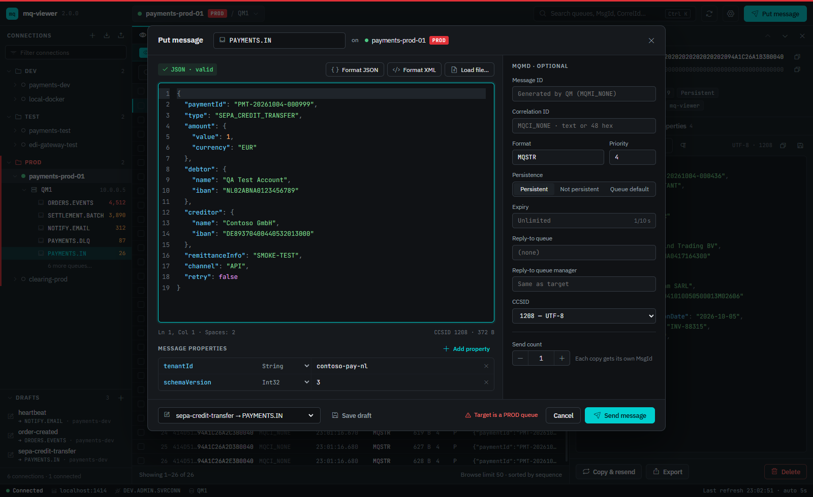
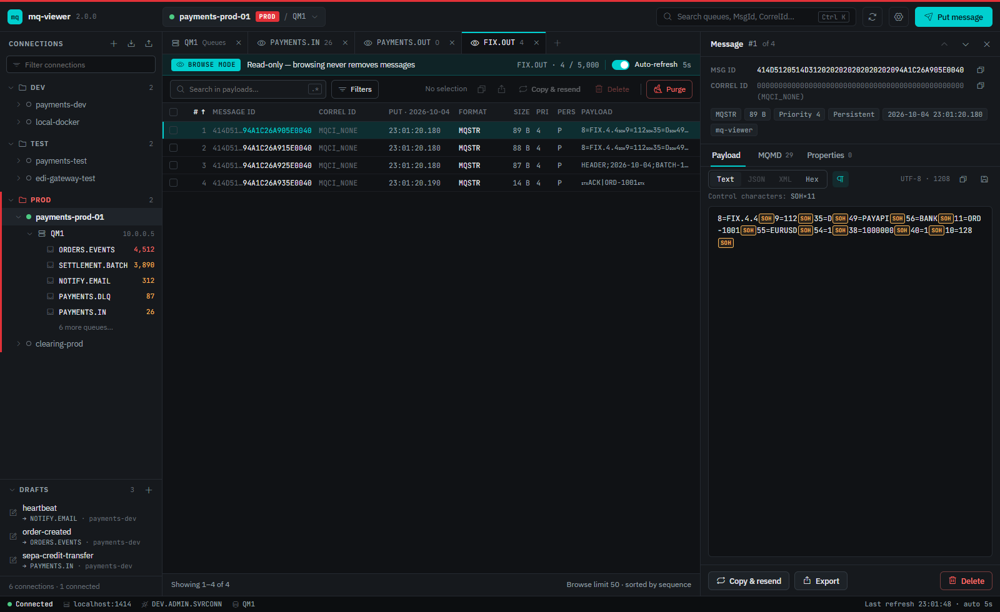
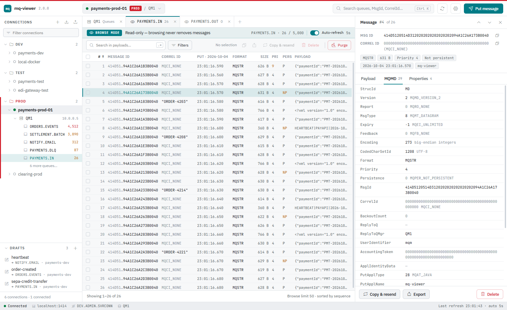
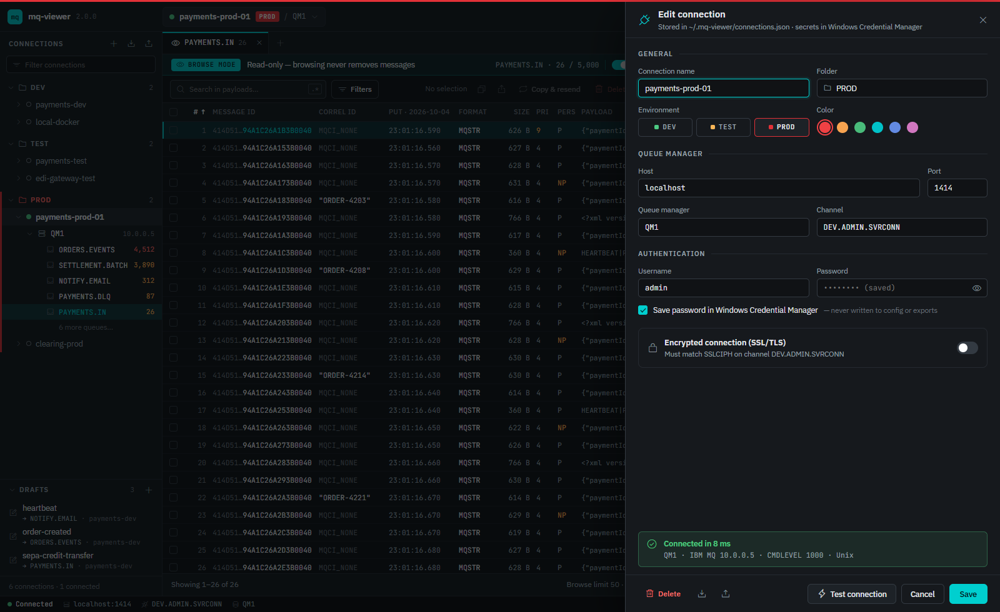
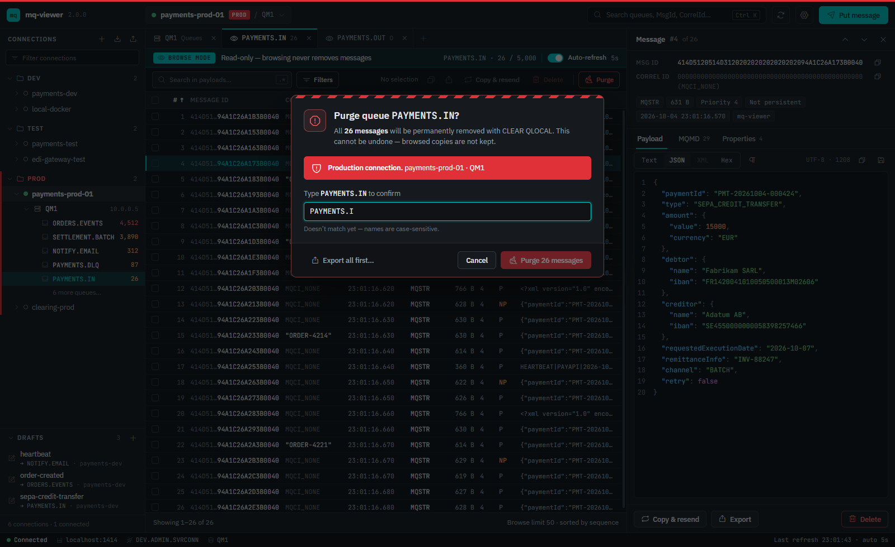
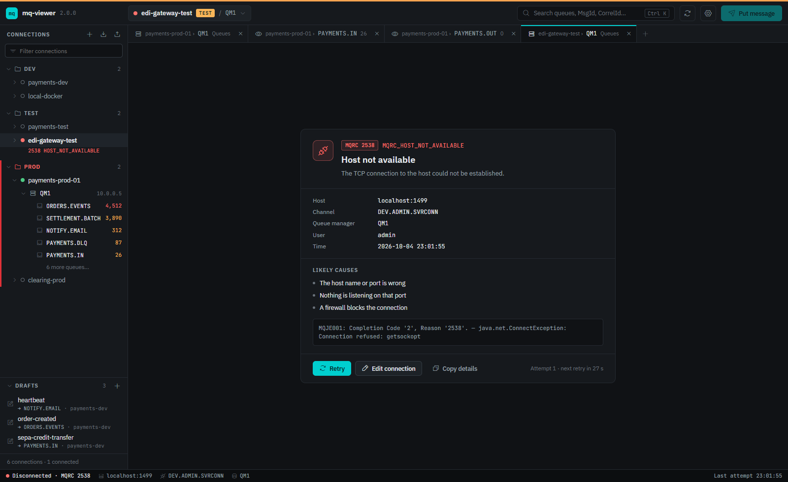

<p align="right"><b>English</b> · <a href="README.tr.md">Türkçe</a></p>

# MQ Viewer

A desktop app for browsing and managing IBM MQ queues. You can list the queues on a queue manager, look at messages without consuming them, read every MQMD field and message property, put test messages, delete selected messages and purge queues.



## Features

- **Connections:** Organise them in folders and tag each one as DEV, TEST or PROD with a colour. Connections can be exported to JSON and imported on another machine; passwords are never included in exports.
- **Passwords in the OS keychain:** Windows Credential Manager, macOS Keychain or Secret Service on Linux, under the service name `mq-viewer`.
- **TLS:** Cipher spec, PKCS#12/JKS keystore and truststore, certificate label and SSL peer name. If the TLS handshake fails, the app shows the certificate chain the server sent.
- **Queue list:** Depth bars (yellow at 70%, red at 85% of max depth), open input/output handle counts (IPPROCS/OPPROCS), a type filter, and an option to hide `SYSTEM.*` queues.
- **Browse mode:** Reading a queue never removes messages from it. You can search in payloads (regex supported), filter and page through results. With auto-refresh on, newly arrived messages are highlighted.
- **Message details:** The payload can be shown as Text, JSON, XML or Hex. All 29 MQMD fields are listed with their constant names (e.g. `MQPER_PERSISTENT`), along with message properties.
- **Control characters:** Optionally shows CR, LF, TAB and ASCII controls such as SOH, STX, ETX and NUL as visible markers, with a summary of what the message contains.
- **Put message:** A syntax-highlighted editor with JSON/XML formatting and loading a body from a file. You can set MQMD options and message properties, and send several copies at once. Control characters (SOH, STX, ETX…) are shown and can be inserted in the editor.
- **Body templates:** `{{ fn() }}` expressions in the body are evaluated separately for every copy, so a batch of N messages can carry different IDs, numbers and timestamps. See [Body templates](#body-templates).
- **Drafts:** Saved sample messages that remember their target queue and connection. Send one in a single click from the sidebar.
- **Delete / Purge:** Delete removes the selected messages by MsgId. Purge empties the whole queue with `CLEAR QLOCAL`, or reads every message off it when that is not allowed. On PROD connections you must type the queue name to confirm.
- **Error screens:** Show the MQ reason code (MQRC), its likely causes and a countdown to an automatic retry.
- Dark, light or system theme; `Ctrl+K` to search queues, connections, drafts and MsgIds.

## Body templates

With **Send count** above 1, every copy is rendered on its own. Expressions use `{{ name(args) }}`, where the arguments are numbers or `'strings'`. Only the functions below exist; nothing is evaluated as JavaScript. Write `\{{` for a literal `{{`. Templates apply to the message body only, and **Preview** in the Put dialog shows the rendered messages before sending.

| Function | Result |
|---|---|
| `index(start = 1, width = 0)` | Position in the batch: start, start+1, …, zero-padded to `width` |
| `randomNumber(min = 0, max = 999999)` | Random integer, both ends inclusive |
| `randomDecimal(min = 0, max = 1, digits = 2)` | Random decimal with fixed digits |
| `randomString(length = 8)` | Random letters and digits |
| `randomHex(length = 16)` | Random hex digits |
| `uuid()` | Random UUID v4 |
| `pick(a, b, …)` | One of the arguments |
| `now(format?)` | ISO 8601 (UTC) by default, or local time with `yyyy MM dd HH mm ss SSS` |
| `timestamp()` | Epoch milliseconds |

```json
{
  "id": "{{uuid()}}",
  "seq": {{index()}},
  "ref": "ORD-{{index(1, 6)}}",
  "amount": {{randomDecimal(10, 500, 2)}},
  "currency": "{{pick('EUR', 'USD', 'TRY')}}",
  "createdAt": "{{now()}}"
}
```

## Screenshots

| | |
|---|---|
|  |  |
| **Queues**: depth bars, IPPROCS/OPPROCS and "no consumers" hints | **Put message**: JSON editor, MQMD options, properties, drafts |
|  |  |
| **Control characters**: SOH, STX, ETX, CR, LF made visible | **Light theme**: all 29 MQMD fields with constant names |
|  |  |
| **Connection**: test result, keychain and TLS settings | **Purge on PROD**: the button stays disabled until the name matches |
|  | |
| **Errors**: reason code, likely causes, automatic retry | |

## Installation

Download the installer for your platform from [Releases](../../releases):

| Platform | Package |
|----------|---------|
| Windows | `.msi` or `-setup.exe` |
| Linux | `.deb`, `.rpm`, `.AppImage` |
| macOS | `.dmg` |

The IBM MQ client and a Java runtime are bundled, so there is nothing else to install. The app connects to queue managers over a client channel (SVRCONN). The MQ REST API (mqweb) is not used.

## Architecture

```
┌──────────────── Tauri (Rust) ────────────────┐   line-delimited JSON   ┌──── Java 21 sidecar ────┐
│ React UI (src/)                              │   over stdin/stdout     │ IBM MQ allclient        │
│ keychain, ~/.mq-viewer/*.json, file dialogs  │ ◄─────────────────────► │ MQI client connection   │
└──────────────────────────────────────────────┘                         │ PCF (queue list, clear) │
                                                                         └─────────────────────────┘
```

| Folder | What lives there |
|--------|------------------|
| `src/` | The UI: React, TypeScript and zustand |
| `src-tauri/` | Desktop shell. Starts and supervises the sidecar, fills saved secrets in from the keychain, and reads/writes the local JSON files |
| `sidecar/` | MQ operations (`MqOps`), TLS (`TlsFactory`), connection pool (`ConnectionPool`) |

There is no server; everything runs on your machine.

## Local data

| Location | Contents |
|----------|----------|
| `~/.mq-viewer/connections.json` | Connections, without secrets |
| `~/.mq-viewer/settings.json` | Theme, browse limit, refresh interval, default CCSID, control-character display |
| `~/.mq-viewer/templates.json` | Drafts |
| OS keychain, service `mq-viewer` | Passwords under `<id>`, `<id>:keystore` and `<id>:truststore` |

If a `connections.properties` file from v1 exists, it is imported automatically the first time the app starts.

## Development

Requirements: Node 22+, Rust (stable) and JDK 21+. Maven is not needed; use `sidecar/mvnw`.

```bash
npm install
npm run sidecar      # builds the sidecar jar and a jlink runtime into src-tauri/resources/
npm run tauri dev    # starts the app in development mode
```

For UI-only work, `npm run dev` opens the app in a browser with a mock backend.

Tests:

```bash
cd sidecar && ./mvnw test     # Java unit tests
cd src-tauri && cargo test    # Rust unit tests
npm run typecheck
```

A local queue manager for testing:

```bash
docker run -d --name mqviewer-qm1 -e LICENSE=accept -e MQ_QMGR_NAME=QM1 \
  -e MQ_APP_PASSWORD=passw0rd -e MQ_ADMIN_PASSWORD=passw0rd \
  -p 1414:1414 icr.io/ibm-messaging/mq:latest
```

Connect to `localhost:1414`, queue manager `QM1`, channel `DEV.ADMIN.SVRCONN`, user `admin` / `passw0rd`.

> On Windows, `cargo build` fails while Smart App Control is turned on, because it blocks the unsigned DLLs that Rust builds for its compile-time macros.

## Packaging

```bash
npm run tauri build
```

On Windows this produces MSI and NSIS installers under `src-tauri/target/release/bundle/`. Pushing a `v*` tag runs `.github/workflows/release.yml`, which builds the Windows, Linux and macOS packages and attaches them to a GitHub release.

## License

MIT
